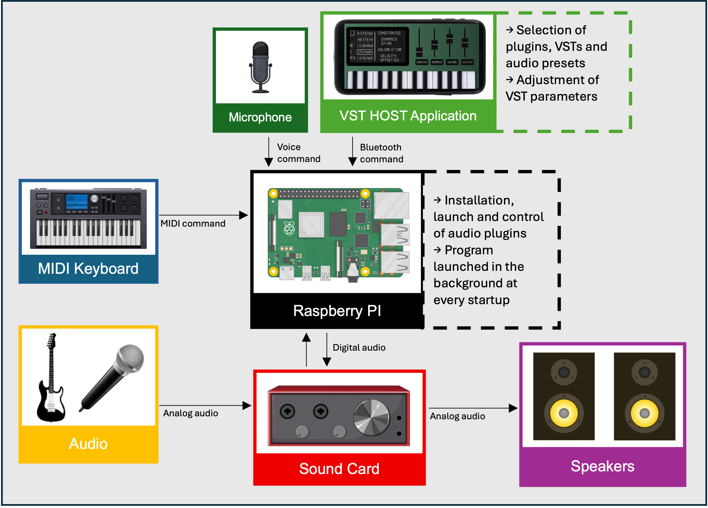

# VST_HOST
A project to host, install, select and control music plugins easily (for midi controller and electric guitar), on a raspberry pi, with an ios app or vocal commands

List of available plugins for the moment:

| Plugins                | Descriptions | Links |
| ---------------------- | ------------ | ----- |
| Carla `(MIDI & Audio)`   | Host for LADSPA, DSSI, LV2 and VST plugins by KXStudio| https://kx.studio/Applications:Carla |
| Organteq `(MIDI)`        | Virtual organs collection plugin by Modartt *(demo version only)*| https://www.modartt.com/organteq_overview?ref=cGFnZT1vcmdhbnRlcSZleHQ9 |
| Pianoteq `(MIDI)`        | Virtual pianos collection plugin by Modartt *(demo version only)*| https://www.modartt.com/pianoteq_overview?ref=cGFnZT1waWFub3RlcSZleHQ9 |
| ZynAddSubFx `(MIDI)`     | Synthesizer software capable of making a countless number of instruments | https://zynaddsubfx.sourceforge.io/ |
| Analog Lab 4 `(MIDI)`    | VST collection plugin by Arturia *(run on raspberry via wine and box64 and with a desktop OS version only / work well with no CPU-intensive VST)*| https://www.arturia.com/fr/products/software-instruments/analoglab/overview |
| Guitarix `(Audio)`       | Virtual guitar amplifier plugin | https://guitarix.org/ |
| Rakarrack-Plus `(Audio)` | Virtual guitar effects pedalboard plugin | https://rakarrack.sourceforge.net/ |


If you don't find the plugin you looking for, you can add its class file in the "Plugins" folder by referring to the other plugin classes and your plugin's API (like MIDI, OSC, JSON-RPC... if it has one).

</img>

https://github.com/user-attachments/assets/63eeb3b5-79a3-4cd0-b571-18d2d85a1bfa


##  System Requirements    

Hardware devices:
- Raspberry PI 5, PI 4B or PI 400 (with at least 2Go of RAM / 4Go recommended)
- Raspeberry pi 3b+ (can be sufficient but limited with CPU-intensive VST or try overclocking) 

OS:
- VST_HOST has been tested on Raspberry pi OS 64-bit Trixie and Bookworm
- note that some plugins works only on 64-bit OS
- VST_HOST work with or without os desktop (without recommended)

You also need a sound card like your faithful Scarlett and of course your favorite midi ou audio instrument


##  Installation    

=> The programm will run automatically when you turn up your Raspberry PI by creating vst_host systemd service
```
git clone https://github.com/TheophileDAL/VST_HOST.git
cd VST_HOST
chmod +x setup.sh
sudo ./setup.sh
sudo reboot
```

=> To disable the service at startup:
```
sudo systemctl disable vst_host.service 2>/dev/null
```

=> To stop the service:
```
systemctl stop vst_host.service 2>/dev/null
```

=> To restart the service:
```
sudo systemctl start vst_host.service
```

=> You can also simply run the program with (`--vc` enable the vocal commands):
```
sudo python3 vst_host.py --vc
```

**You need to be in root mode if you count to install plugins by using VST_HOST with the app**


##  iOS App    

Simulated on iPhone 11 to 17 => Soon in the app store...

Source code : https://github.com/TheophileDAL/VST_HOST_APP


## Upcoming Features

| Services | Descriptions |
| -------- | ------------ |
| Transport Bar | Audio and MIDI recording / Loop / Export recordings to a PC... |
| Favorites | Save and manage your favorite VSTs |
| Default VST | Choose a VST to automatically launch when the Raspberry Pi starts |
| Preview | Preview a VST sound before loading it to make selection easier |


## Report a Bug / Suggestion

https://theophile.atlassian.net/jira/software/form/8be1f6e4-b8d0-430a-b8c4-e822f1a0f7e0?atlOrigin=eyJpIjoiYmFiNGExNDMyYTA5NDJkNDgzMmU4ZDJhOGE2NzgwZDAiLCJwIjoiaiJ9
